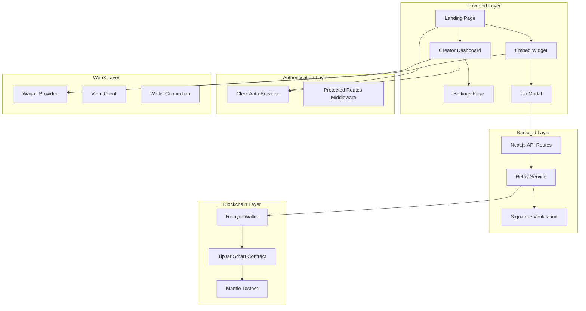

# Design Document

## Overview

The Mantle Tip Jar is a full-stack Web3 application that enables gasless cryptocurrency tipping through meta-transaction relaying. The system consists of a Next.js frontend with embedded widgets, a smart contract on Mantle network, and a backend relay service that sponsors gas fees for tip transactions.

The application follows a three-phase development approach: static UI scaffolding, dynamic frontend with authentication, and finally blockchain integration. This ensures a solid foundation and iterative development process.

## Architecture

### High-Level System Architecture



### Technology Stack

- **Frontend Framework**: Next.js 14+ with App Router
- **Styling**: Tailwind CSS with Shadcn/ui component library
- **Authentication**: Clerk for user management and session handling
- **Web3 Integration**: Wagmi v2 + Viem for modern React hooks and Ethereum interactions
- **Smart Contract Development**: Hardhat with Solidity
- **Blockchain Network**: Mantle Testnet (low-cost Layer 2)
- **State Management**: React hooks with Tanstack Query for server state

## Components and Interfaces

### Frontend Components

#### 1. Landing Page (`app/page.tsx`)
- **Purpose**: Creator sign-up and marketing
- **Key Elements**: Hero section, feature highlights, Clerk SignUp component
- **Styling**: Split layout with yellow branding section and white form section
- **Navigation**: Redirects to onboarding flow after successful sign-up

#### 2. Onboarding Flow
- **Complete Profile** (`app/onboarding/complete-profile/page.tsx`)
  - Avatar upload with Shadcn Avatar component
  - Form fields: Name, Website/Social Link, About section
  - Uses Shadcn Input and Textarea components
  
- **Payout Setup** (`app/onboarding/payout-method/page.tsx`)
  - Wallet connection interface using Wagmi useConnect hook
  - Mantle network configuration
  - Skip option for later setup

#### 3. Creator Dashboard (`app/dashboard/page.tsx`)
- **Claimable Balance Display**: Real-time balance from smart contract
- **Recent Tips Table**: Paginated list with sender, amount, timestamp
- **Withdraw Functionality**: Direct smart contract interaction
- **Navigation**: Links to settings and embed code

#### 4. Settings Page (`app/dashboard/settings/page.tsx`)
- **Embed Code Generator**: Dynamic iframe with creator ID
- **Copy to Clipboard**: One-click embed code copying
- **Profile Management**: Link to update profile information

#### 5. Embed Widget (`app/embed/[creatorId]/page.tsx`)
- **Tip Button**: Branded "Tip Me on Mantle" call-to-action
- **Modal Integration**: Shadcn Dialog for tip flow
- **Responsive Design**: Works across different embed contexts

#### 6. Tip Modal Component
- **Amount Input**: Validated numeric input with preset amounts
- **Wallet Connection**: Wagmi integration for wallet selection
- **Transaction Flow**: EIP-712 signing and relay submission
- **Status Feedback**: Loading states and success/error messages

### Backend Components

#### 1. Relay API Route (`app/api/relay-tip/route.ts`)
- **Signature Verification**: EIP-712 signature validation using viem
- **Transaction Execution**: Smart contract interaction via relayer wallet
- **Error Handling**: Comprehensive error responses and logging
- **Security**: Rate limiting and input validation

#### 2. Authentication Middleware (`middleware.ts`)
- **Route Protection**: Clerk-based authentication for dashboard routes
- **Public Routes**: Landing page and embed widgets remain accessible
- **Redirect Logic**: Proper handling of authenticated/unauthenticated states

### Web3 Provider Setup

#### 1. Wagmi Configuration
```typescript
// Mantle Testnet configuration
const mantleTestnet = {
  id: 5003,
  name: 'Mantle Testnet',
  network: 'mantle-testnet',
  nativeCurrency: { name: 'MNT', symbol: 'MNT', decimals: 18 },
  rpcUrls: {
    default: { http: ['https://rpc.sepolia.mantle.xyz'] },
    public: { http: ['https://rpc.sepolia.mantle.xyz'] }
  }
}
```

#### 2. Provider Hierarchy
```typescript
// app/layout.tsx structure
<ClerkProvider>
  <Web3Provider>
    <QueryClient>
      {children}
    </QueryClient>
  </Web3Provider>
</ClerkProvider>
```

## Data Models

### Smart Contract Data Structures

#### 1. TipJar Contract State
```solidity
struct Creator {
    uint256 claimableBalance;
    bool isActive;
}

mapping(address => Creator) public creators;
mapping(bytes32 => bool) public processedSignatures;
```

#### 2. EIP-712 Typed Data Structure
```typescript
const tipTypedData = {
  domain: {
    name: 'MantleTipJar',
    version: '1',
    chainId: 5003,
    verifyingContract: contractAddress
  },
  types: {
    Tip: [
      { name: 'fan', type: 'address' },
      { name: 'creator', type: 'address' },
      { name: 'amount', type: 'uint256' },
      { name: 'nonce', type: 'uint256' }
    ]
  },
  message: {
    fan: fanAddress,
    creator: creatorAddress,
    amount: tipAmount,
    nonce: uniqueNonce
  }
}
```

### Frontend Data Models

#### 1. Creator Profile
```typescript
interface CreatorProfile {
  id: string;
  name: string;
  avatar?: string;
  website?: string;
  about?: string;
  walletAddress?: string;
  claimableBalance: string;
}
```

#### 2. Tip Transaction
```typescript
interface TipTransaction {
  id: string;
  fanAddress: string;
  creatorAddress: string;
  amount: string;
  timestamp: Date;
  transactionHash: string;
  status: 'pending' | 'confirmed' | 'failed';
}
```

## Error Handling

### Frontend Error Handling

#### 1. Wallet Connection Errors
- **No Wallet Detected**: Guide user to install MetaMask or compatible wallet
- **Wrong Network**: Prompt user to switch to Mantle Testnet
- **Connection Rejected**: Provide retry option with clear messaging

#### 2. Transaction Errors
- **Insufficient Balance**: Clear error message with balance information
- **Signature Rejected**: Allow retry without losing form data
- **Network Errors**: Retry mechanism with exponential backoff

#### 3. API Errors
- **Rate Limiting**: Display cooldown timer and retry option
- **Server Errors**: Generic error message with support contact
- **Validation Errors**: Field-specific error messages

### Backend Error Handling

#### 1. Signature Verification Failures
```typescript
// Invalid signature response
{
  error: 'INVALID_SIGNATURE',
  message: 'Signature verification failed',
  code: 400
}
```

#### 2. Smart Contract Interaction Errors
```typescript
// Transaction failure response
{
  error: 'TRANSACTION_FAILED',
  message: 'Unable to process tip transaction',
  details: contractError.message,
  code: 500
}
```

### Smart Contract Error Handling

#### 1. Access Control
```solidity
modifier onlyRelayer() {
    require(msg.sender == relayerAddress, "Unauthorized");
    _;
}
```

#### 2. Replay Protection
```solidity
modifier nonceNotUsed(bytes32 signatureHash) {
    require(!processedSignatures[signatureHash], "Signature already used");
    _;
}
```

## Testing Strategy

### Unit Testing

#### 1. Frontend Component Tests
- **React Testing Library**: Component rendering and user interactions
- **Jest**: Business logic and utility functions
- **Mock Providers**: Wagmi and Clerk provider mocking for isolated tests

#### 2. Smart Contract Tests
- **Hardhat Testing**: Comprehensive contract function testing
- **Waffle Matchers**: Ethereum-specific assertions
- **Test Scenarios**: Normal operations, edge cases, and security tests

#### 3. API Route Tests
- **Next.js Testing**: API endpoint testing with mock requests
- **Signature Verification**: EIP-712 signature validation testing
- **Error Scenarios**: Invalid inputs and failure conditions

### Integration Testing

#### 1. End-to-End User Flows
- **Playwright**: Full user journey testing from sign-up to tip completion
- **Wallet Integration**: MetaMask automation for Web3 interactions
- **Cross-Browser**: Testing across different browsers and devices

#### 2. Smart Contract Integration
- **Testnet Deployment**: Testing against actual Mantle Testnet
- **Relay Service**: Full meta-transaction flow testing
- **Gas Optimization**: Transaction cost analysis and optimization

### Security Testing

#### 1. Smart Contract Security
- **Slither Analysis**: Static analysis for common vulnerabilities
- **Manual Review**: Access control and business logic verification
- **Testnet Stress Testing**: High-volume transaction testing

#### 2. Backend Security
- **Input Validation**: Comprehensive input sanitization testing
- **Rate Limiting**: API abuse prevention testing
- **Signature Verification**: Cryptographic security validation

## Development Phases

### Phase 0: Static UI Scaffolding
- **Goal**: Complete visual user journey without functionality
- **Deliverables**: All pages with static content and navigation
- **Duration**: Foundation for rapid iteration and design validation

### Phase 1: Dynamic Frontend & Authentication
- **Goal**: Interactive application with authentication and mock data
- **Deliverables**: Working dashboard, settings, and tip modal with simulated backend
- **Duration**: User experience validation before blockchain complexity

### Phase 2: Backend & Blockchain Integration
- **Goal**: Fully functional dApp with smart contract integration
- **Deliverables**: Deployed smart contract, relay service, and complete tip flow
- **Duration**: Production-ready application with real blockchain interactions

This phased approach ensures solid foundations, early user feedback, and manageable complexity progression while building toward a production-ready decentralized application.